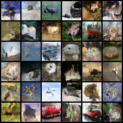

# Simple Variational Diffusion Models

> Note! This is still work in progress and may contain errors. If you lke to contribute, please leave a pull request.

A simple (~700 line) PyTorch implementation of the "[Variational Diffusion Models](https://arxiv.org/abs/2107.00630)" paper by Kingma et al.
Much of it was inspired by the [lucidrains](https://github.com/lucidrains/denoising-diffusion-pytorch) and [revsic](https://github.com/revsic/jax-variational-diffwave) repositories.

[Most of the paper and code are documented on my blog post]([https://davidruhe.github.io/notes/Variational-Diffusion-Models](https://davidruhe.github.io/2021/12/31/variational-diffusion-models.html)). If any part of either the code or the blog is not well-documented. Please let me know!

Please also see references below.

# Requirements
- Python 3.9
- CUDA 11.5

# Running
1. `git clone https://github.com/DavidRuhe/simple-variational-diffusion-models.git`
2. `cd simple-variational-diffusion-models`
3. `source activate_py3.sh`
4. `python main.py`

# To Do
1. Network adjustments reported in Appendix.
2. Fourier features.
3. Reproduce paper results.

# References
#### ArXiV
- [Kingma et al., 2021](https://arxiv.org/abs/2107.00630)
- [Ho et al., 2020](https://arxiv.org/abs/2006.11239)
- [Song et al., 2021](https://arxiv.org/abs/2011.13456)
- [Rombach et al., 2021](https://arxiv.org/abs/2112.10752)

#### GitHub
- [revsic/jax-variational-diffwave](https://github.com/revsic/jax-variational-diffwave)
- [Lucidrains/denoising-diffusion-pytorch](https://github.com/lucidrains/denoising-diffusion-pytorch)
